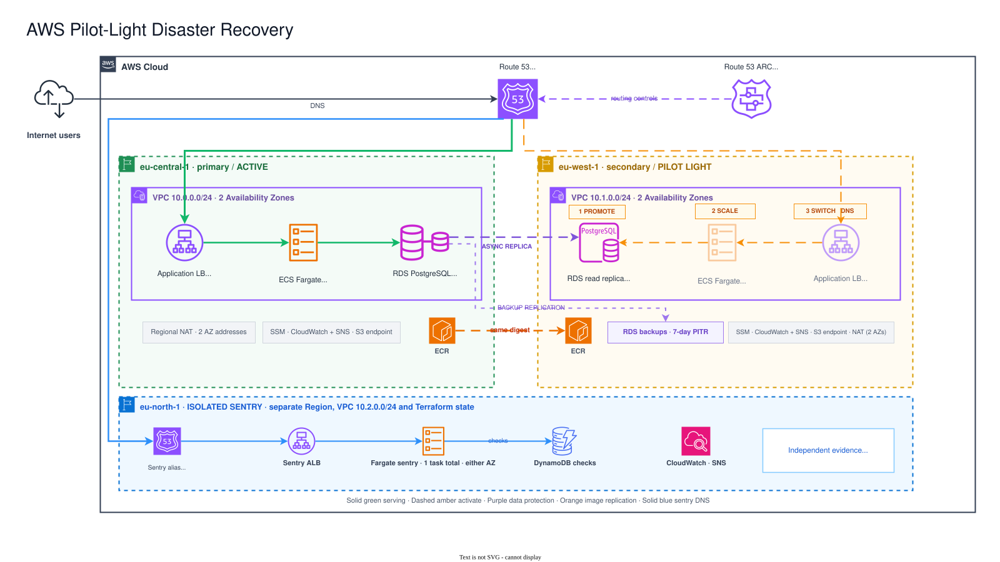
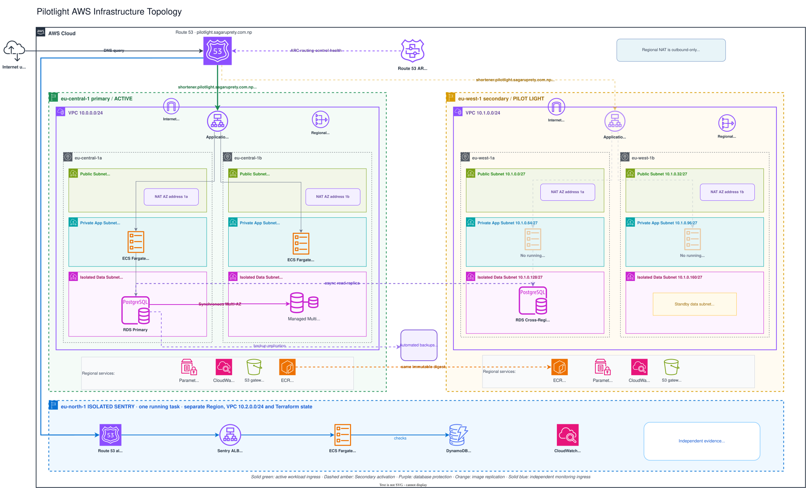
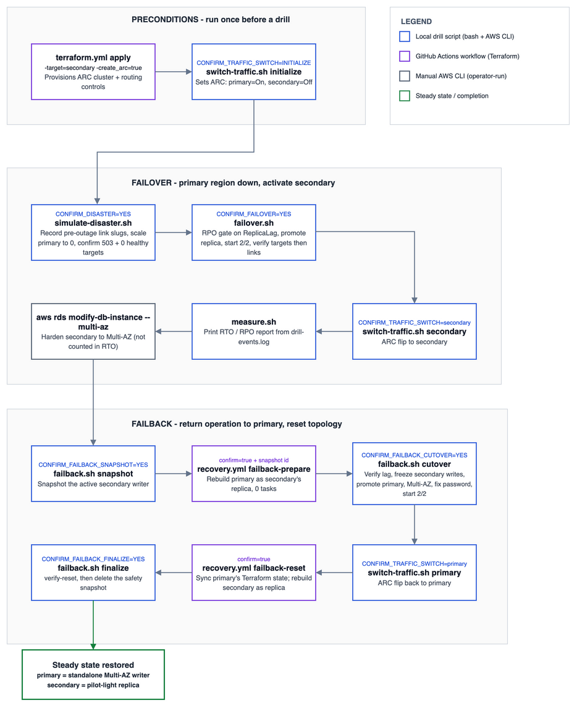

# Pilotlight


This project is a working demonstration of the pilot-light disaster recovery strategy on AWS. Please read here for more details about this strategy: [AWS Architecture Blog](https://aws.amazon.com/blogs/architecture/disaster-recovery-dr-architecture-on-aws-part-iii-pilot-light-and-warm-standby/).

As an overview, AWS defines pilot light as replicating your data to a second Region and provisioning a copy of your core workload infrastructure there. Resources that carry data, such as databases, stay on continuously. Everything else is deployed and configured but switched off, and is only started for testing or when recovery is invoked. That keeps standby cost low while leaving the core infrastructure in place, so recovery is a matter of starting compute and moving traffic, not building a Region from scratch.

This project maps to that definition as follows:

| Pilot light requires | This project |
|---|---|
| Data replicated continuously to a second Region | RDS PostgreSQL cross-region read replica, kept in sync and monitored through CloudWatch `ReplicaLag` |
| Core infrastructure provisioned in the standby Region | VPC, subnets, ALB, ECS service definition, ECR image, and SSM parameters all applied by Terraform in `eu-west-1` |
| Application resources switched off until needed | The secondary ECS service is held at zero desired count, so no task runs and no compute is billed |
| Infrastructure as code deployed to every Region | The same Terraform modules build both Regions, with different variables and separate state |
| Protection against data corruption as well as Region loss | Cross-region automated backups with a 7-day point-in-time-recovery window, independent of the replica |
| A tested path, including a way back | Failover, failback, and in-region drills are scripted, operator-gated, and executed against live infrastructure |


## At a glance

| | |
|---|---|
| Regions | `eu-central-1` primary, `eu-west-1` secondary, `eu-north-1` monitoring |
| Compute | ECS Fargate, two tasks across two Availability Zones |
| Database | RDS PostgreSQL, Multi-AZ primary with a cross-region read replica |
| Traffic control | Route 53 Application Recovery Controller routing controls |
| Targets | RTO 30 minutes, RPO 60 seconds |
| Measured | RTO 666 seconds, RPO 26.0 seconds against live infrastructure, 2026-08-08 |
| Infrastructure | Terraform |
| Recovery | Bash drill scripts and approval-gated GitHub Actions |

## Applications

Two Go services live in this repository:

### URL shortener [`apps/url-shortener`](apps/url-shortener/README.md)

It is a small PostgreSQL-backed service that creates short links behind a bearer token and serves public redirects.

Drill scripts use its links to check for data loss. A link created on the primary region before an outage must be readable from the secondary after promotion, and a link created on the secondary region during the outage must be readable from the primary after failback.

The bearer token is generated as a Terraform ephemeral value, so it never appears in state or output. Read it from SSM instead:

```bash
aws ssm get-parameter --region eu-central-1 --name "/pilotlight/primary/link-create-token" --with-decryption --query 'Parameter.Value' --output text
```

Same command with `--region eu-west-1` reads secondary's copy of the same token.

### Sentry [`apps/sentry`](apps/sentry/README.md)

It is a monitoring service that polls the workload's public health endpoint on an interval, stores its check history in DynamoDB, and reads live ECS and RDS state (of the active url shortener region) through read-only AWS APIs to report the topology of both workload Regions.

It runs in `eu-north-1`, outside both drill Regions, with its own VPC and its own Terraform state, so it keeps observing and recording through a complete regional failover of the workload.

<!-- Screenshots of the sentry status UI go here. -->

## Architecture

### System overview



Three independent failure domains, each with separate Terraform state.

`eu-central-1` serves live traffic behind an ALB into two ECS Fargate tasks spread across two Availability Zones, writing to a Multi-AZ RDS PostgreSQL instance.

`eu-west-1` holds the same network, ALB, and ECS service definition, with the service at zero desired count. Its database is a cross-region read replica in continuous sync, while no compute runs at all. That keeps standby cost low and recovery in minutes.

`eu-north-1` runs the Sentry (monitoring service) against read-only APIs.

Route 53 ARC holds the only traffic switch. DNS answers depend on ARC routing-control state rather than ALB health, so traffic cannot move to a standby that has not been verified ready.

### Infrastructure topology



Both workload regions use the same three-tier VPC across two availability zones: public subnets for the ALB and NAT Gateway, private subnets for ECS tasks, and isolated database subnets with no route to the internet.

Two mechanisms protect the database, covering different failures:

| Mechanism | Covers | Recovery time |
|---|---|---|
| Cross-region read replica | Regional loss, promoted to a standalone writer during failover | Minutes |
| Cross-region automated backups with 7-day PITR | Corruption or deletion, since a replica copies corrupted data faithfully and a backup does not | Minutes to an hour, restored into an isolated instance |

Container images are built once, pushed to ECR by immutable digest, and replicated to the secondary Region so both Regions run an identical artifact. Database passwords and the workload's write token are generated as Terraform ephemeral values and written to regional SSM SecureString parameters through write-only arguments, so plaintext stays out of Terraform state.

## Recovery



Traffic never moves automatically. Each step verifies the previous one before it will run, and each requires an explicit confirmation.

**Failover.** Confirm a real outage using two independent signals, HTTP 503 and zero healthy ALB targets. Gate promotion on fresh CloudWatch `ReplicaLag` evidence. Promote the replica, scale the secondary to two tasks across two Availability Zones, confirm the promoted database accepts new writes, then flip ARC and verify authoritative DNS is serving the new Region.

**Failback.** Snapshot the active writer, rebuild the primary as a replica of the secondary, wait for replication to drain fully, freeze writes, promote the primary, restore Multi-AZ, reconcile credentials, and return traffic last.

*Note: Two failback steps run through an approval-gated GitHub Actions workflow instead of a local script, because they change which instance replicates from which. That is a structural Terraform change, so it goes through plan review and a protected environment.*

### Evidence

Every drill step appends a timestamped event to `drill-events.log`. `scripts/drills/measure.sh` reads the current drill segment and prints the recovery timeline, end-to-end RTO, and the CloudWatch `ReplicaLag` value captured at promotion.

## Getting started (If you want to try it yourself)

This section deploys the stack into an AWS account. To run the applications on your machine without an AWS account, skip to [Development](#development).

### Cost Notice
Please be aware that deploying aws resources incurs real cost. Please always destroy the resources you create to avoid unnecessary cost.

### Prerequisites

- [AWS CLI v2](https://docs.aws.amazon.com/cli/latest/userguide/getting-started-install.html), configured with credentials for the target account.
- Permissions on those credentials for two separate jobs. Bootstrap is applied by hand and creates IAM resources, so it needs to create an OIDC identity provider, roles, and policies, alongside S3 and Route 53. The drill scripts then call ECS, RDS, ELB, ECR, SSM, CloudWatch, Route 53, and ARC directly. This project provisions no separate local recovery role, so whoever runs a drill uses their own credentials.
- [Terraform](https://developer.hashicorp.com/terraform/install) 1.11 or newer.
- [jq](https://jqlang.github.io/jq/), used by `scripts/config.sh` and every drill script.
- [GitHub CLI](https://cli.github.com), optional. The Actions tab dispatches the same workflows.
- [Docker](https://docs.docker.com/get-started/get-docker/) with Compose, optional, for running the applications locally.
- A domain or subdomain you control and can point nameservers at, either registered directly or delegated from a parent zone.
- A GitHub repository with two protected environments named `terraform-production` and `production`, and the repository variables listed under [Configure](#configure).

Only bootstrap and the drills use your own credentials. Every deploy runs in GitHub Actions under short-lived OIDC roles instead.

### Configure

Every value below is account-specific. Set them before the first apply; the defaults in this repository point at the author's account and domain.

**`config.json`.** Project name, base domain, the four Regions (including `arc`'s fixed `us-west-2`) with their Availability Zones, and the `create_arc` toggle. Single source of truth for Terraform, the workflows, and the drill scripts.

**Per-environment tfvars.**

| File | Key | Set to |
|---|---|---|
| `bootstrap/terraform.tfvars` | `state_bucket_name` | A globally unique S3 bucket name |
| `monitoring/terraform.tfvars` | `alert_email`, `github_org`, `github_repo`, `deploy_service` | Alert recipient, your repository coordinates, and the two-phase deploy flag |
| `primary/terraform.tfvars` | same, plus `credential_version`, `link_token_version`, `multi_az` | Rotation counters and the Multi-AZ toggle |
| `secondary/terraform.tfvars` | `alert_email` | Alert recipient |
| `arc` | none; takes only `config.json`'s `create_arc` | Independent of primary and secondary's own lifecycle, since ARC needs both ALBs and neither region owns it |

Set `deploy_service` to `false` initially, before any of the deploy steps.

Each region's `alert_email` gets its own SNS subscription: confirm each one in email.


**GitHub environments.** Create two, named exactly `terraform-production` and `production`, restrict each to deployments from `main`, and require a reviewer. Required reviewers needs a public repo (or a paid plan on a private one). The names are pinned in the OIDC trust policies, so a job can only assume the role matching the environment it declares.

### Deploy Steps

The commands below use the [GitHub CLI](https://cli.github.com). Without it, dispatch the same workflows from the repository's **Actions** tab: pick the workflow, choose **Run workflow**, and set the inputs shown in each `-f` flag.

**1. Bootstrap.** Creates the S3 state backend, the GitHub OIDC identity provider, the Terraform plan and apply roles, and the Route 53 hosted zone for `base_domain`. This is the one stage applied by hand, because CI cannot create the credentials it needs to run. It is applied once and left in place.


```bash
terraform -chdir=terraform/environments/bootstrap init
terraform -chdir=terraform/environments/bootstrap plan -out=bootstrap.tfplan
terraform -chdir=terraform/environments/bootstrap apply bootstrap.tfplan
```

Delegate `base_domain` by creating an NS record in the parent zone pointing at the four nameservers in the `route53_zone_name_servers` output

```bash
dig +short NS pilotlight.sagaruprety.com.np
```

GitHub repository variables: Set the following from the output above

| Variable | Value |
|---|---|
| `AWS_TERRAFORM_ROLE_ARN` | `terraform_github_apply_role_arn`, from the bootstrap output |
| `AWS_TERRAFORM_PLAN_ROLE_ARN` | `terraform_github_plan_role_arn`, from the bootstrap output |


**2. Create the monitoring foundation.** VPC, ALB, ECR repository, and the DynamoDB table for check history.

```bash
gh workflow run terraform.yml --ref main -f operation=apply -f target=monitoring
```

GitHub repository variables: Set the following from the output above

| Variable | Value |
|---|---|
| `AWS_SENTRY_ROLE_ARN` | `github_actions_role_arn`

**3. Publish the sentry image, then deploy it.** The first apply intentionally leaves the ECS service uncreated, since it cannot reference an image that does not exist yet.

```bash
gh workflow run ecs-sentry.yml --ref main -f mode=publish-only
```

Set `deploy_service = true` in `terraform/environments/monitoring/terraform.tfvars`, merge it, then apply again:

```bash
gh workflow run terraform.yml --ref main -f operation=apply -f target=monitoring
```

**4. Create the primary workload foundation.** Primary VPC, ECR repository, and supporting infrastructure, with no running service yet.

```bash
gh workflow run terraform.yml --ref main -f operation=apply -f target=primary
```

GitHub repository variables. Set the following from the output above

| Variable | Value |
|---|---|
| `AWS_URL_SHORTENER_ROLE_ARN` | `github_actions_role_arn`|


**5. Publish the workload image, then deploy it.** Same two-phase pattern as the sentry.

```bash
gh workflow run ecs-url-shortener.yml --ref main -f mode=publish-only
```

Set `deploy_service = true` in `terraform/environments/primary/terraform.tfvars`, merge it, then apply again:

```bash
gh workflow run terraform.yml --ref main -f operation=apply -f target=primary
```

**6. Create the secondary pilot light.** Secondary VPC, ALB, cross-region read replica, and the ECS service held at zero desired count.

```bash
gh workflow run terraform.yml --ref main -f operation=apply -f target=secondary
```

ARC routing controls bill per cluster-hour, so they are provisioned for the duration of a drill and removed afterwards. They live in their own `arc` target, applied only when a drill needs them; see [`runbook-failover.md`](docs/runbook-failover.md#provision-arc). `create_arc` is committed as `false` in `config.json`.

### Run the drills

If you want to see the effects of pilot-light in action yourself, run the drills below in the order:

**1. In-region drills first.** [`docs/runbook-ha.md`](docs/runbook-ha.md) covers task loss, Availability Zone capacity loss, and an RDS Multi-AZ failover. These stay inside the primary Region and never touch replica promotion or routing controls, so they are the cheapest way to confirm the baseline is genuinely healthy. A regional drill started from a degraded baseline proves nothing, and the scripts refuse to run if the baseline is not two healthy tasks across two Availability Zones.

**2. Regional failover.** [`docs/runbook-failover.md`](docs/runbook-failover.md) provisions ARC, injects the outage, promotes the replica, moves traffic, and measures the result.

**3. Failback.** [`docs/runbook-failback.md`](docs/runbook-failback.md) returns operation to the primary Region and restores the resting topology. Each step gates on evidence the failover recorded, so the two runbooks run as one continuous sequence with the same `DRILL_LOG`.

### Coverage

Each row is a real injected failure with a defined recovery expectation, and every one has either a drill script or a documented procedure.

| Layer | Injected failure | Expected recovery | Exercised by |
|---|---|---|---|
| Application process | Stop one ECS task | ALB drops the target, ECS replaces it, no user-visible outage | `simulate-ha.sh task` |
| AZ compute | Stop all tasks in one Availability Zone | Surviving zone serves traffic, ECS restores desired count | `simulate-ha.sh az` |
| AZ database | Force an RDS Multi-AZ failover | Application reconnects through the unchanged endpoint, interruption measured | `simulate-ha.sh db` |
| Regional failure | Full pilot-light failover | Executes against measured RTO and RPO targets | `runbook-failover.md`, `runbook-failback.md` |
| Data corruption | Restore a cross-region backup into an isolated instance | Known pre-corruption data verified present | Manual, `runbook-failover.md` § Logical corruption |
| Configuration drift | Compare image digests, task definitions, and SSM state across Regions | Prerequisites confirmed before a drill starts | `failover.sh` preflight, `scripts/ci/guard-topology.sh` |
| DNS control plane | Exercise ARC and its documented fallback | Traffic moves only after the secondary is verified ready | `switch-traffic.sh`; the Route 53 fallback is documented but unexercised |

Do not stop at a successful failover; run the failback. Otherwise the workload stays in the secondary Region with a diverged primary and no standby.

### Tear down

Destroy the stack when a drill cycle is finished to avoid costs.

```bash
gh workflow run terraform.yml --ref main -f operation=destroy -f target=primary -f confirm_destroy=DESTROY
```

`operation=destroy` ignores `target` and always runs secondary, then primary, then monitoring, since the secondary database replicates from the primary and monitoring only observes the other two.

Bootstrap is deliberately excluded, so the state backend, OIDC roles, and hosted zone survive a teardown and the nameservers stay valid.

To remove those too, run the following:

```bash
terraform -chdir=terraform/environments/bootstrap destroy
```

## Development (Sentry Monitoring Service and URL Shortener)

Requires Docker and Docker Compose.

```bash
docker compose up --build
```

This starts the sentry on `localhost:8080`, the URL shortener on `localhost:8081`, and PostgreSQL. The sentry reads a static topology (mock data), since live ECS and RDS topology only exists once deployed.

Tests and static checks, no AWS credentials required:

```bash
(cd apps/sentry && go test ./...)
(cd apps/url-shortener && go test ./...)
terraform fmt -check -recursive terraform
tflint --recursive --config="$(pwd)/.tflint.hcl" --chdir=terraform
shellcheck --source-path=SCRIPTDIR scripts/config.sh scripts/ci/*.sh scripts/drills/*.sh
pre-commit run --all-files
```

## Security

- The sentry task role holds read-only `Describe`, `List`, and `Get` actions on ECS and RDS, plus scoped `PutItem` and `Query` on its own DynamoDB table.
- The workload execution role is scoped to the exact SSM parameter ARNs and KMS key it needs to start.
- CI authenticates through GitHub OIDC with short-lived roles, each scoped to one GitHub environment: infrastructure apply and destroy behind `terraform-production`, application deploys behind `production`, plan read-only from pull requests.
- Database passwords and the workload write token are generated as Terraform ephemeral values and written directly to SSM SecureString parameters.
- Recovery operations that mutate infrastructure require an explicit confirmation variable and a protected-environment approval between plan and apply.

## Project structure

```
config.json          project name, base domain, regions, AZs: read by Terraform and the scripts
apps/
  sentry/            monitoring service: checks, history, topology, status UI
  url-shortener/     workload under test: link creation and redirects
terraform/
  modules/           vpc, alb, ecs-url-shortener, ecs-sentry, rds, ecr, alerting,
                     route53-failover, acm-cert, app-deploy-iam, terraform-ci-iam
  environments/
    bootstrap/       state backend, GitHub OIDC roles, Route 53 hosted zone
    monitoring/      sentry: own Region, own state, own lifecycle
    primary/         primary Region workload
    secondary/       pilot-light secondary Region
    arc/             Route 53 ARC failover pair; independent of primary and secondary
scripts/
  drills/            operator-gated drill automation and shared drill library
  ci/                CI guards and cleanup helpers
docs/                architecture diagrams and runbooks
.github/workflows/   application build and deploy, Terraform plan and apply, guarded recovery
```

## License

MIT. See [LICENSE](LICENSE).
