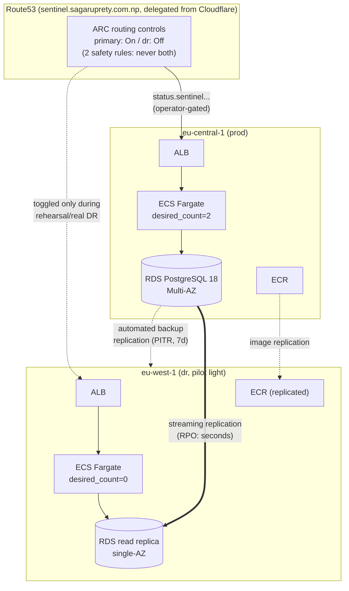

# Architecture

## Overview

Every module (`vpc`, `alb`, `ecs-service`, `rds`, `monitoring`) is reused as-is between `environments/prod` and `environments/dr` — DR is not a hand-maintained copy, it is the same code composed with different variables (`desired_count=0`, `multi_az=false`, a replica source ARN). This is the single biggest reason drift between the two environments is structural rather than something that has to be manually kept in sync.

## Prod-First Apply, DR-First Destroy

**Apply order is prod, then DR, never the reverse.** DR's Terraform reads several of prod's outputs via `data.terraform_remote_state` (see below) — image digest, RDS ARN and engine version, the DR-region SSM parameter ARN, ALB DNS/zone IDs. None of those exist until prod has been applied at least once. Attempting `terraform apply` in `environments/dr` against a prod state with no outputs yet fails at plan time with a clear "attribute does not exist" error rather than silently doing the wrong thing — this was hit directly while building the route53-failover module's `alb_zone_id` output.

**Destroy order is the reverse: DR first, then prod.** Two hard dependencies force this:
1. The cross-region **read replica** (`environments/dr`'s `rds` module, `replicate_source_db_arn`) has `replicate_source_db` pointed at prod's instance ARN. RDS refuses to delete a source instance that still has an active read replica — prod's `terraform destroy` would fail outright until the replica is gone.
2. **Automated backups replication** (`aws_db_instance_automated_backups_replication`, applied in prod's state but replicating *into* eu-west-1) and the **ECR replication configuration** are both prod-side resources whose destination is DR. Destroying DR's VPC/networking first, while these still reference it, risks orphaned replication state rather than a clean teardown.

## Non-Secret Remote-State Dependencies

`environments/dr/main.tf` reads exactly these prod outputs via `data.terraform_remote_state.prod` (S3 backend, `sentinel/prod/terraform.tfstate`):

| Output | Used for |
|---|---|
| `ecr_repository_url` | Constructing the replicated image URI (region substring swapped) |
| `image_digest` | DR's task definition pulls the identical digest, not a re-resolved tag |
| `rds_engine_version` | The `check` block asserting eu-west-1's resolved version matches before replica creation |
| `rds_instance_arn` | `replicate_source_db_arn` for the cross-region replica |
| `rds_instance_class` | DR replica matches prod's class instead of a second hardcoded value |
| `database_password_dr_ssm_arn` | DR's ECS task execution role reads its own region's SSM parameter, never prod's |
| `alb_dns_name` / `alb_zone_id` | The route53-failover module's primary alias target |

Nothing secret crosses this boundary — the actual database password never appears in either state file (`password_wo` / `value_wo` are write-only arguments; Terraform sends them to the API without persisting them). The DR-region SSM parameter holding the real password is a separate resource in prod's state, created via the `aws.dr` provider alias, and DR reads only its *ARN*, not its value.

## Bootstrap-State Regional Dependency

The Terraform state backend itself — the S3 bucket and DynamoDB-equivalent lock file both `prod` and `dr` write to — lives in **eu-central-1** (`terraform/environments/bootstrap`), the same region as prod. This is a real, currently-unaddressed single point of dependency: if eu-central-1 has a regional outage severe enough to also take S3 in that region down, `terraform apply`/`plan` against either environment's state becomes unavailable at exactly the moment a DR response would need it. State *reads* during an actual incident are for verification/planning only — the operator scripts (`failover.sh` etc.) drive recovery through the AWS CLI directly, not through Terraform, so this dependency affects auditability and drift-checking during an incident, not the recovery mechanism itself. Mitigating this (e.g., a second bootstrap state bucket in eu-west-1) is out of scope for this project's ephemeral, cost-conscious design.

## Promotion and ECS Drift

The moment `failover.sh` runs, prod's Terraform-managed reality diverges from what any environment's Terraform config declares, in three ways that a subsequent `terraform plan` will surface:

1. **DR's `rds` module** still declares `replicate_source_db_arn` pointing at prod — but the instance is no longer a replica after promotion. Terraform doesn't detect "this replica was promoted" as a drift signal on its own; the module's `aws_db_instance.replica` resource will simply report attributes that no longer match a replica (no `read_replica_source_db_instance_identifier`).
2. **DR's `ecs` module** declares `desired_count = var.desired_count` (0 by default) — but `failover.sh` scales the real ECS service to 2 directly via `aws ecs update-service`, bypassing Terraform entirely. `terraform plan` after the drill will show a diff wanting to scale it back to 0.
3. **DR's task definition** gets a new revision registered directly by `failover.sh` (to bind the promoted endpoint), separate from whatever revision Terraform's `aws_ecs_task_definition.app` resource last created.

This drift is intentional and expected during a live incident — a human should not want Terraform quietly reconciling a service mid-recovery. It's also why the M4 acceptance criteria require running `terraform plan` after the drill specifically to *see* this drift as evidence, then reconciling deliberately (see `runbook-failover.md`) rather than either ignoring it or letting the next unrelated `apply` silently scale DR back down.

## Reconciliation Procedure

Two real incidents this session forced a general procedure, not just one-off fixes:

**When a `terraform apply` is interrupted mid-run, assume it kept running server-side.** The CLI/tool layer being interrupted does not necessarily kill the underlying process, and a killed process does not necessarily mean AWS-side resource creation stopped — only that Terraform never got to record the result in state. Before retrying:
1. `terraform force-unlock` the stale S3 lock if one is held.
2. For every resource the *next* plan wants to create that has a plausibly-unique real-world identity (an ALB has one ARN per name; a NAT gateway attached to a specific pair of EIPs is identifiable), check AWS directly for an existing orphan before letting Terraform create a second one.
3. Cross-reference by a real attribute already in state (e.g. this session matched an orphan NAT gateway's EIP allocation IDs against `aws_eip.nat[0/1]`'s already-tracked allocation IDs) rather than assuming the newest-created resource is the right one.
4. `terraform import` the confirmed orphan; delete anything confirmed to be a genuine duplicate (not the same resource, an actual second one that failed).
5. Re-plan. Tag-only or default-tag drift on freshly-imported resources is expected and benign; 0 destroys is the bar for "safe to apply."

**When a module change alters a resource's state address** (adding `count` or `for_each` to a previously-bare resource, as happened extending the `rds` module for cross-region replicas), run `terraform state mv` to the new address (e.g. `aws_db_instance.main` → `aws_db_instance.main[0]`) *before* the next plan. Skipping this makes Terraform plan to destroy and recreate the real resource under the new address — for a database, this is not a cosmetic mistake.

**When splitting a `cd` from the terraform command it's meant to apply to across separate tool calls, don't.** A near-miss this session came from exactly that: a `plan` ran in the wrong directory because directory state wasn't verified in the same call as the command depending on it. Every terraform command in this project's operational history is now run as `cd <path> && pwd && terraform ...` in one call, with `pwd` as a cheap, load-bearing assertion, not decoration.
